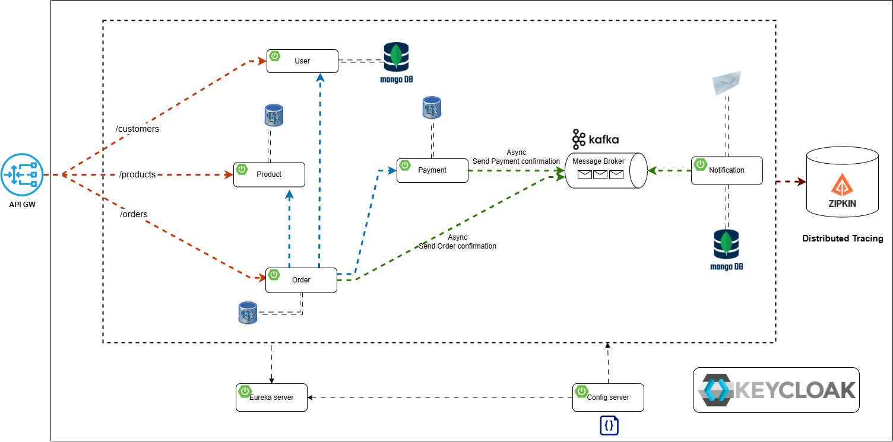

# 🛍️ TechShop Microservices

An end-to-end demo e-commerce backend built with **Spring Boot** microservices, **Kafka** event streams, and **Keycloak**-secured APIs.  
This project is a collection of Spring Boot microservices orchestrated with Docker Compose. The repository includes services for user management, product catalog, orders, payments, notifications, and more. Each service is located under the `services/` directory and built with Gradle.



---

## 📝 System Overview

**TechShop** demonstrates domain-driven design, event sourcing and eventual consistency for an online store scenario.

| Layer            | Technology                    |
|------------------|-------------------------------|
| Language         | Java 21                       |
| Framework        | Spring Boot 3 / Spring Cloud  |
| Async Messaging  | Apache Kafka                  |
| API Gateway      | Spring Cloud Gateway          |
| Service Discovery| Eureka                        |
| Configuration    | Spring Cloud Config           |
| AuthN/AuthZ      | Keycloak                      |
| Datastores       | MongoDB, PostgreSQL           |
| Tracing          | Zipkin                        |
| Containerisation | Docker & Docker Compose       |

---

## 🏗️ Services

| Name                     | Path                            | Default Port | Database   | Synopsis                                    |
|--------------------------|----------------------------------|--------------|------------|---------------------------------------------|
| **API Gateway**          | `services/api-gateway`           | `8080`       | –          | Edge routing, JWT validation, rate limiting |
| **Discovery**            | `services/discovery`             | `8761`       | –          | Eureka naming service                       |
| **Config Server**        | `services/config-server`         | `8888`       | –          | Centralised config from `config-repo`       |
| **User Service**         | `services/user-service`          | `7000`       | MongoDB    | CRUD users, login hook                      |
| **Product Service**      | `services/product-service`       | `7001`       | MongoDB    | Catalog management                          |
| **Order Service**        | `services/order-service`         | `7002`       | PostgreSQL | Order lifecycle, inventory check            |
| **Payment Service**      | `services/payment-service`       | `7003`       | –          | Stripe-like payment orchestration           |
| **Notification Service** | `services/notification-service`  | `7004`       | MongoDB    | Email notifications                         |

---

## 🚀 Getting Started

```bash
# Clone & bootstrap
git clone https://github.com/Peczenko/microservice-techshop.git
cd microservice-techshop
./gradlew clean build          # build all services

# Spin up infrastructure + services
docker compose up --build -d
```

---

## 📋 Prerequisites

- Java 21
- Docker and Docker Compose
- Gradle wrapper (`./gradlew`)

Create an `.env` file in the project root (already provided) with your Docker Hub credentials:

```env
DOCKER_USERNAME=
DOCKER_PASSWORD=
```

Leave these blank when working with local images.

---

## 🧰 Running the Stack

There are two ways to build and run the services:

### 1. Local Images

1. Ensure `DOCKER_USERNAME` is empty in `.env`.
2. Build Docker images locally:
   ```bash
   ./gradlew jibDockerBuild
   ```
3. Start everything with Docker Compose:
   ```bash
   docker compose up
   ```

### 2. Push to Docker Hub

1. Set your Docker Hub credentials in `.env`:
   ```env
   DOCKER_USERNAME=your_dockerhub_username
   DOCKER_PASSWORD=your_dockerhub_password
   ```
2. Build and push images to Docker Hub:
   ```bash
   ./gradlew jib
   ```
3. Launch the stack:
   ```bash
   docker compose up
   ```

---

## 📡 API Endpoints and Permissions

Below is a high level overview of the REST endpoints exposed by the microservices and the permissions required to access them.

### 🧑‍💼 user-service

| Method | Path                                              | Permissions                |
|--------|---------------------------------------------------|----------------------------|
| GET    | `/api/v1/users`                                   | `ADMIN`                    |
| POST   | `/api/v1/users`                                   | `ADMIN`                    |
| GET    | `/api/v1/users/{id}`                              | `ADMIN` or resource owner  |
| GET    | `/api/v1/users/info-for-order/{id}`               | `ADMIN` or order service   |
| GET    | `/api/v1/users/{userId}/keycloak-id/{keycloakId}` | `ADMIN` or allowed service |
| POST   | `/api/v1/users/register`                          | public                     |
| POST   | `/api/v1/users/login`                             | public                     |
| DELETE | `/api/v1/users/{id}`                              | `ADMIN`                    |
| PUT    | `/api/v1/users/forgot-password`                   | public                     |

### 🛒 product-service

| Method | Path                           | Permissions   |
|--------|--------------------------------|---------------|
| GET    | `/api/v1/products`             | `MEMBER`      |
| POST   | `/api/v1/products`             | `ADMIN`       |
| GET    | `/api/v1/products/{id}`        | `MEMBER`      |
| POST   | `/api/v1/products/{id}/photos` | `ADMIN`       |
| DELETE | `/api/v1/products/{id}/photos` | `ADMIN`       |
| POST   | `/api/v1/products/purchase`    | order service |

### 📦 order-service

| Method | Path                           | Permissions                       |
|--------|--------------------------------|-----------------------------------|
| GET    | `/api/v1/orders`               | `ADMIN`                           |
| GET    | `/api/v1/orders/{orderId}`     | `ADMIN` or order owner            |
| POST   | `/api/v1/orders/create`        | `ADMIN` or user placing the order |
| GET    | `/api/v1/orders/user/{userId}` | `ADMIN` or order owner            |

### 💳 payment-service

| Method | Path                             | Permissions                                 |
|--------|----------------------------------|---------------------------------------------|
| POST   | `/api/v1/payments/create`        | `ADMIN` or order service                    |
| GET    | `/api/v1/payments`               | `ADMIN`                                     |
| GET    | `/api/v1/payments/{id}`          | `ADMIN` or payment owner with role `MEMBER` |
| GET    | `/api/v1/payments/user/{userId}` | `ADMIN` or payment owner with role `MEMBER` |

### 📢 notification-service

This service listens on Kafka topics and does not expose REST endpoints.

---

This setup gives you a complete microservice playground for experimenting with Spring Boot, Docker, and cloud‑native patterns.
